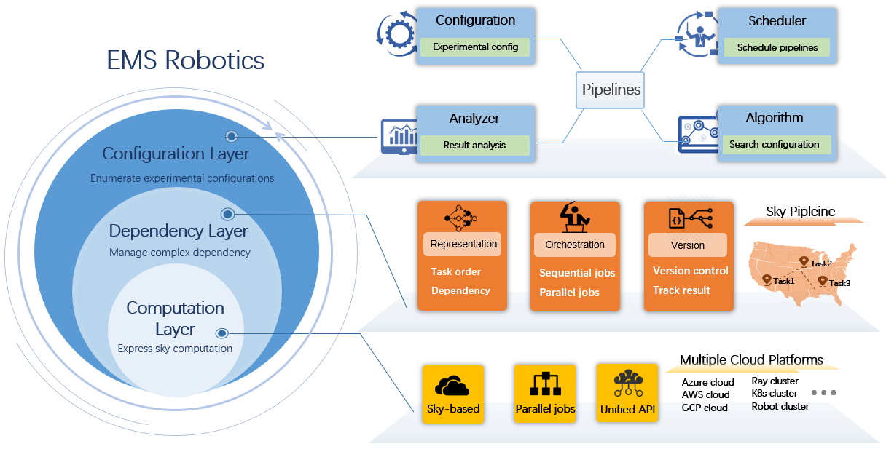

# EMS Client Documentation



## Quickstart

To run this example, you need to connect magics VPN and obtain code-server access from administrator. 

In this quick-start example you minimize a simple function of the form f(x) = a**2 + b, our objective. The closer a is to zero and the smaller b is, the smaller the total value of f(x). We will define a so-called search space for a and b and let EMS explore the space for good values.

```ruby
def main(config):
  a,b = config["a"], config["b"]
  score = a ** 2 + b 
  return score

if __name__ == "__main__":
  config = {"a":1, "b":2}
  main(config)
```

## EMS Files Tree

To use EMS to seach the space for good values, we need to implement several files. The file tree looks like this

```
├── ems
│   ├── config/params.py
│   ├── tasks/add/__main__.py
│   └── pipelines/pipeline_v1.py
├── run.py
```

## 1 Parameter definition.

`ems/config/params.py` specifies parameters in running EMS experiments. Setting a default is optional. In this example, the parameters are a and b. Then `ems/config/params.py` should look like

```ruby
import dataclasses

@dataclasses.dataclass
class ParamsConfig:
  a: int = 2
  b: int = 1
```


## 2 Task Defintion.

`ems/tasks/{task_name}` reperesents a task in a EMS expriment. It can be a preprocess task, or model training task, or prediction task. Specifically, a task is like a python module, where the entrypoint of the module is specified by `__main__.py`. It optionally takes inputs, performs an action, and produces an optional result. In fact, it is easy to create a task in EMS. 

In this example, the `ems/tasks/add/__main__.py` should look like:

```ruby
import ems

@ems.task
def main(config, args):
  a = config.params.a
  b = config.params.b

  score = a ** 2 + b
  return {"score":score}

if __name__ == "__main__":
  main()
```

In this file, the `main()` function should use `ems.task` decrator to obtained configurations from EMS. The task can report metric by returning a dictionary. 

The input arguments contains `config` and `*args`. `config` represents the configuration infomation and `args` contains the path infomation for this task. `args.task_result_path` and `args.{dependency_task_name}` are two important arguments in experiments. These two arguments are list of string. Specifically,  `args.task_result_path[0]` is the folder for saving task generated result. For example use should save trained model in `args.task_result_path[0]`. If the a model training task (name=A) is depending on a data preprocess task(name=B). Then task A can get result from task B by reading files in the `args.B[0]` folder.

## 3 Pipeline Defnition.

`ems/pipelines/pipeline_v1.py` represents a pipeline DAG of EMS experiment. In EMS, a experiment is called a pipeline. This file specified the computation resources of each task and task flow of a pipeline.

In this example, `ems/pipelines/pipeline_v1.py` should look like this:

```ruby
import ems

version_seed = "0001"

@ems.pipeline
def pipeline_flow(pipeline_name):
  cpu_instance = ems.ComputationInstance(vcpus=15, gpus=0, memory=15)
  flow = [ems.create_task(name="add", ver=pipeline_name, 
    path="add", computation=cpu_instance, deps={}),]
  return flow
```

Specifically, `version_seed` specifies the version number of a pipeline. User must specify the task flow and computation resource in `pipelineflow()` funcition. The computation resource is specified by `ems.ComputationInstance()` class, The task flow is a list of `ems.create_task()`, each one specifying the task name, module path, computation and dependency. If we have a task depedening on "add" task, we use `deps={"add": ems.Dep("add"),}`


## 4 EMS Entroypoint.

`run.py` specifies the search space for pipelines and pipelines file name.  Then by calling `ems.run_configurations()`, EMS runs the pipeline parallel for each specified configuration. By calling `ems.get_best_config()`, EMS return the best configurations according to the repored metrics in the task.By calling `ems.get_results()`, EMS return a list of repored metrics of all running experiments.

```ruby
import ems

def main():
  # Define list of configuration, each configuration is a configuration files
  search_space = [ 
  { "params":{"a": 0, "b": 1,}, }, 
  { "params":{"a": 0, "b": 20,}, },
  { "params":{"a": 1, "b": 10,}, },
  ]
  pipeline_dag = "pipeline_v2"

  # Run experiments
  ems.run_configurations(
    pipeline_dag = pipeline_dag,
    search_space = search_space,
  )

  # Get experiment results
  results = ems.get_results(
    pipeline_dag = pipeline_dag,
    search_space = search_space,
  )
  print("Reported metrics",results)

  # Analyze results
  best_config = ems.get_best_config(
    pipeline_dag = pipeline_dag,
    search_space = search_space,
    metric = "score",
    mode = "min",
  )
  print("Best config:",best_config)

  return

if __name__ == "__main__":
  main()
```


## 5 Run 

We can run experiments executing following command in the terminal. We can simply run `ems-run` with default setting. Also, we can specify client configurations by passing arguments.

```
ems_run --client_name="client1" --entrypoint="python run.py"
```


## More

## APIS

Detailed API documentation is in [link](docs/API.md).
